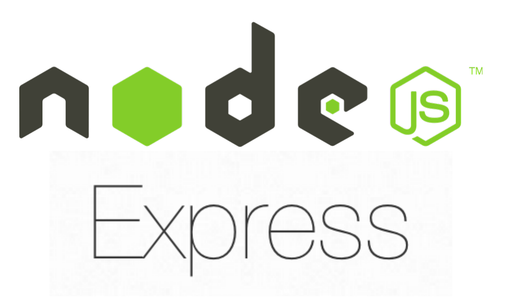
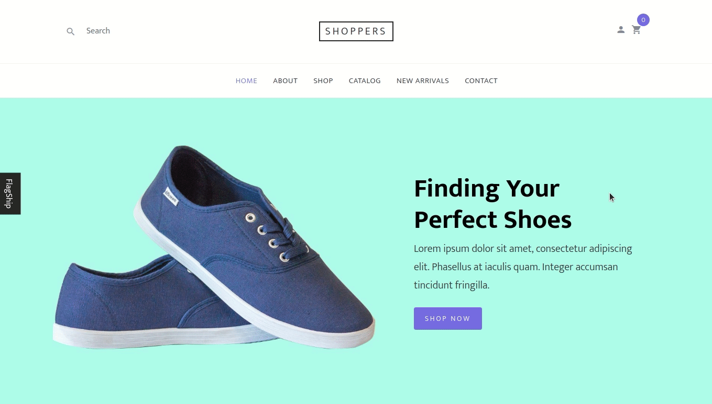

<h3 align="center">Bring your features to life</h3>

<!-- ALL-CONTRIBUTORS-BADGE:START - Do not remove or modify this section -->

<!-- ALL-CONTRIBUTORS-BADGE:END -->

## Docs

**Visit [https://developers.flagship.io/](https://developers.flagship.io/) to get started with Flagship.**

-   [Installation & Getting Started](https://developers.flagship.io/docs/sdk/javascript/v2.1#getting-started)
-   [API Reference](https://developers.flagship.io/docs/sdk/javascript/v2.1#api-reference)
-   [SDK Settings](https://developers.flagship.io/docs/sdk/javascript/v2.1#sdk-settings)
-   [Flagship class](https://developers.flagship.io/docs/sdk/javascript/v2.1#flagship-class)
-   [Flagship visitor](https://developers.flagship.io/docs/sdk/javascript/v2.1#flagshipvisitor-class)
-   [Getting modifications](https://developers.flagship.io/docs/sdk/javascript/v2.1#getting-modifications)
-   [Campaign synchronization](https://developers.flagship.io/docs/sdk/javascript/v2.1#campaign-synchronization)
-   [Hit tracking](https://developers.flagship.io/docs/sdk/javascript/v2.1#hit-tracking)
-   [Release Notes](https://github.com/abtasty/flagship-js-sdk/blob/master/RELEASENOTES.md)
-   [Contributing](https://github.com/abtasty/flagship-js-sdk/blob/master/CONTRIBUTING.md)

## Examples

-   With Express JS:

[Readme 📖](examples/api-server/README.md)

**NOTE**: The demo is runnable locally only.

-   CodeSandbox with Express JS:

[Live Demo 🕹](https://codesandbox.io/s/flagship-js-sdk-server-example-zuusm)

-   With React, inside react component:

[Readme 📖](examples/react-app/README.md)

[Live Demo 🕹](https://abtasty.github.io/flagship-js-sdk/)

-   With React, using cookies:

[Readme 📖](https://github.com/abtasty/flagship-react-sdk/tree/master/examples/react-ecommerce-demo)

[Live Demo 🕹](https://react-ecommerce-demo.internal.flagship.io/)

-   With stand alone version:

[Live Demo 🕹](https://codesandbox.io/s/fs-js-sdk-standalone-version-hoeb9)

## Contributors

<!-- ALL-CONTRIBUTORS-LIST:START - Do not remove or modify this section -->
<!-- prettier-ignore-start -->
<!-- markdownlint-disable -->
<table>
  <tr>
    <td align="center"><a href="https://www.domenge.fr/"> <b>Emilien Domenge</b></a> <a href="https://github.com/abtasty/flagship-js-sdk/commits?author=Emidomenge" title="Code">💻</a> <a href="https://github.com/abtasty/flagship-js-sdk/commits?author=Emidomenge" title="Documentation">📖</a> <a href="#example-Emidomenge" title="Examples">💡</a> <a href="#maintenance-Emidomenge" title="Maintenance">🚧</a></td>
    <td align="center"><a href="https://github.com/guillaumejacquart"> <b>Guillaume Jacquart</b></a> <a href="https://github.com/abtasty/flagship-js-sdk/issues?q=author%3Aguillaumejacquart" title="Bug reports">🐛</a> <a href="https://github.com/abtasty/flagship-js-sdk/pulls?q=is%3Apr+reviewed-by%3Aguillaumejacquart" title="Reviewed Pull Requests">👀</a></td>
    <td align="center"><a href="https://yanistam.me/"> <b>Yanis Tam</b></a> <a href="https://github.com/abtasty/flagship-js-sdk/commits?author=Madorakkusu" title="Code">💻</a></td>
    <td align="center"><a href="https://julien-madiot.fr/"> <b>Julien Madiot</b></a> <a href="https://github.com/abtasty/flagship-js-sdk/commits?author=Madi-Ji" title="Code">💻</a> <a href="#ideas-Madi-Ji" title="Ideas, Planning, & Feedback">🤔</a></td>
  </tr>
</table>

<!-- markdownlint-enable -->
<!-- prettier-ignore-end -->

<!-- ALL-CONTRIBUTORS-LIST:END -->

## Licence

[Apache License.](https://github.com/abtasty/flagship-js-sdk/blob/master/LICENSE)
