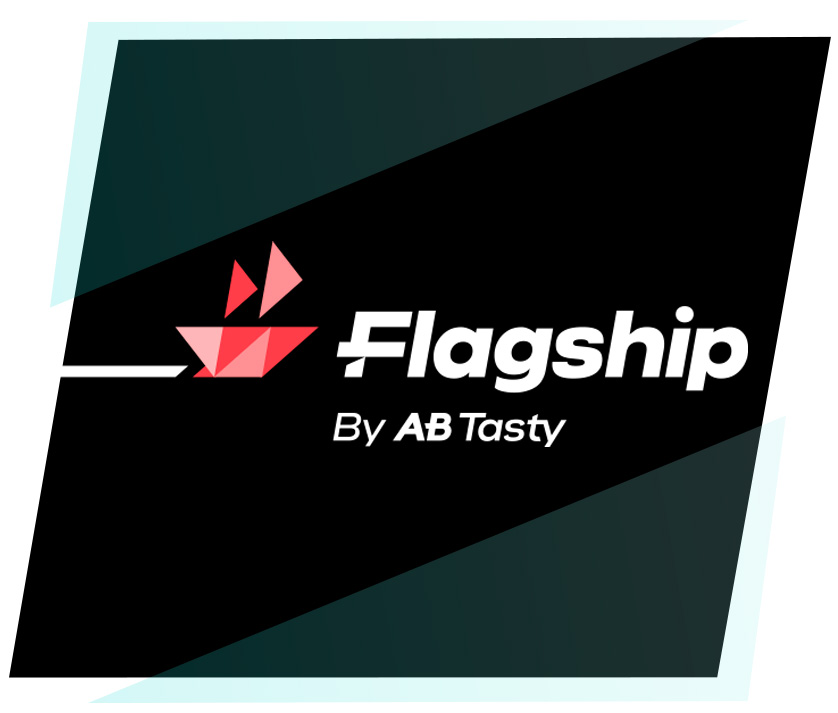

# Flagship - JS SDK

## Prerequisites

- **Node.js**: version 6.0.0 or later...

- **Npm**: version 3.0.0 or later...

## Good to know

<ul style="line-height:1.4;">
- Typescript supported ✅
</ul>

<ul style="line-height:1.4;">
- <a href='https://bundlephobia.com/result?p=@flagship.io/js-sdk'>Light weight SDK 🏋</a>  <span style="color: gray;">(Gzipped size=10.9kB~)</span>
</ul>

<ul style="line-height:1.4;">
- How to use the SDK in practice ☕ : 
<ul style="line-height:1.4;">
<li>
<a href='examples/react-app/README.md'>with React</a>
<ul style="line-height:1.4;"><li><a href='https://abtasty.github.io/flagship-js-sdk/'>👉online demo 😎</a></li></ul>
</li>
<li><a href='examples/api-server/README.md'>with Express</a></li>
</ul>
</ul>
<ul style="line-height:1.4;">
- <a href='./RELEASENOTES.md'>Release notes</a> available to stay in touch 👍
</ul>

# Getting Started

## 1. **Install** the node module:

```
npm install @flagship.io/js-sdk
```

## 2. **Import** it in your code:

```
import flagship from "@flagship.io/js-sdk"; // ES6 ++

const flagship = require("@flagship.io/js-sdk"); // ES5
```

## 3. **Initialize**:

```
const sdk = flagship.start("YOUR_ENV_ID", { /* sdk settings */ });
```

## 4. **Create** a visitor:

```
const visitorInstance = sdk.newVisitor("YOUR_VISITOR_ID",{
    //...
    some: "VISITOR_CONTEXT",
    //...
});

visitorInstance.on('ready', () => {
    console.log('visitorInstance is ready ! ✨')
});
```

## 5. **Get** modifications:

```
const {btnColor, btnText} = visitorInstance.getModifications([{key: "btnColor", defaultValue: "#ff0000"}, {key: "btnText", defaultValue: "Wahoo !"}]);

console.log(btnColor); // output: "#fff"
console.log(btnText); // output: "Awesome !"
```

This is one of the basic workflow you can achieve with the SDK. 🙂

# SDK Settings

This is all available settings which you can set on the SDK.

Those settings can be setup using [start function](#start) (sample inside).

Here are the attributes which you can set inside the SDK settings object:

<table class="table table-bordered table-striped">
    <thead>
    <tr>
        <th style="width: 100px;">Argument</th>
        <th style="width: 50px;">Type</th>
        <th style="width: 50px;">Default</th>
        <th>Description</th>
    </tr>
    </thead>
    <tbody>
        <tr>
          <td>fetchNow</td>
          <td>boolean</td>
          <td>false</td>
          <td>Decide to fetch automatically modifications data when creating a new <a href='README.md#flagshipvisitor-class'>FlagshipVisitor</a>.</td>
        </tr>
        <tr>
          <td>activateNow</td>
          <td>boolean</td>
          <td>false</td>
          <td>Decide to trigger automatically the data when creating a new <a href='README.md#flagshipvisitor-class'>FlagshipVisitor</a>.<br><b>NOTE</b>: when set to <i>true</i>, it will implicitly set <i>fetchNow=true</i> as well.</td>
        </tr>
        <tr>
          <td>enableConsoleLogs</td>
          <td>boolean</td>
          <td>false</td>
          <td>Enable it to display logs on the console when SDK is running.<br>This will only display logs such as <i>Warnings</i>, <i>Errors</i>, <i>Fatal errors</i> and <i>Info</i>.</td>
        </tr>
        <tr>
          <td>nodeEnv</td>
          <td>string</td>
          <td>'production'</td>
          <td>If value is other than <i>production</i>, it will also display <i>Debug</i> logs.</td>
        </tr>
        <tr>
          <td>flagshipApi</td>
          <td>string</td>
          <td>'https://decision-api.flagship.io/v1/'</td>
          <td>
          This setting can be useful in further scenario:<br>
          - If you need to mock the API for tests such as end to end.<br>
          - If you want to move to an earlier version the Flagship API (v2, v3,...).
          </td>
        </tr>
        <tr>
          <td>apiKey</td>
          <td>string</td>
          <td>null</td>
          <td>If you want to use the <a href="http://developers.flagship.io/api/v2/">Decision API V2</a>, you must contact the support team so they'll provide you an API Key to authenticate the calls.</td>
        </tr>
        <tr>
          <td>initialModifications</td>
          <td>Array(object)</td>
          <td>null</td>
          <td>This is an array of modifications where each element must be same shape as <a href="http://developers.flagship.io/api/v1/#mode">element inside "campaigns" attribute</a>.<br>Providing this prop avoid the SDK to have an empty cache during first initialization.<br>If the shape of an element is not correct, an error log will give the reason why.
        </tr>
</tbody>

</table>

# JS SDK Features

## Summary

Don't hesitate to have a look to the main [Flagship technical doc](http://developers.flagship.io/) as well. 😊

### _flagshipSdk_ object

- [start](#start)

### <i>Flagship</i> class

- [newVisitor](#newVisitor)

### <i>FlagshipVisitor</i> class

- [events listener](#events-listener)
- [updateContext](#updateContext)
- [synchronizeModifications](#synchronizeModifications)
- [getAllModifications](#getAllModifications)
- [getModificationsForCampaign](#getModificationsForCampaign)
- [getModifications](#getModifications)
- [getModificationInfo](#getModificationInfo)
- [activateModifications](#activateModifications)
- [sendHit](#sendHit)
- [sendHits](#sendHits)

### <i>Shape</i> of possible hits to send

- [Transaction Hit](#transaction-hit)
- [Screen Hit](#screen-hit)
- [Item Hit](#item-hit)
- [Event Hit](#event-hit)

---

# _flagshipSdk_ object

## `start`

> return a `Flagship` instance.

<table class="table table-bordered table-striped">
    <thead>
    <tr>
        <th style="width: 100px;">Attribute</th>
        <th style="width: 50px;">Type</th>
        <th style="width: 50px;">Default</th>
        <th>Description</th>
    </tr>
    </thead>
    <tbody>
        <tr>
          <td>envId</td>
          <td>string</td>
          <td>*required*</td>
          <td>Your Flagship environment id.</td>
        </tr>
        <tr>
          <td>config</td>
          <td>object</td>
          <td>defaultConfig</td>
          <td>Setup SDK settings. It will override attributes from default configuration so you just need to specify attributes which you need to change. You can check config attributes <a href='#sdk-settings'>here</a>.</td>
        </tr>
    </tbody>
</table>

> **Demo:**

```
const sdk = flagship.start("YOUR_ENV_ID",
{
    enableConsoleLogs: true,
    fetchNow: false,
});
```

# <i>Flagship</i> class

## Summary

- [newVisitor](#newVisitor)

## `newVisitor`

> return a <a href='README.md#flagshipvisitor-class'>FlagshipVisitor</a> instance.

<table class="table table-bordered table-striped">
    <thead>
    <tr>
        <th style="width: 100px;">Attribute</th>
        <th style="width: 50px;">Type</th>
        <th style="width: 50px;">Default</th>
        <th>Description</th>
    </tr>
    </thead>
    <tbody>
        <tr>
          <td>id</td>
          <td>string</td>
          <td>*required*</td>
          <td>Your Flagship visitor id.</td>
        </tr>
        <tr>
          <td>context</td>
          <td>object</td>
          <td>{}</td>
          <td>Your Flagship visitor context. You'll set inside attributes which should match those defined in your campaigns.</td>
        </tr>
    </tbody>
</table>

> **Demo:**

```
const visitorInstance = sdk.newVisitor("YOUR_VISITOR_ID",{
    //...
    some: "VISITOR_CONTEXT",
    //...
});

visitorInstance.on('ready', () => {
    console.log('visitorInstance is ready ! ✨')
});
```

# <i>FlagshipVisitor</i> class

## Summary

- [events listener](#events-listener)
- [updateContext](#updateContext)
- [synchronizeModifications](#synchronizeModifications)
- [getAllModifications](#getAllModifications)
- [getModificationsForCampaign](#getModificationsForCampaign)
- [getModifications](#getModifications)
- [getModificationInfo](#getModificationInfo)
- [activateModifications](#activateModifications)
- [sendHit](#sendHit)
- [sendHits](#sendHits)

## `events listener`

`FlagshipVisitor` contains further event listener which help you to handle the SDK.

If want to listen a listener, here an example:

<table class="table table-bordered table-striped">
    <thead>
    <tr>
        <th style="width: 100px;">Event listener</th>
        <th>Is called multiple times ?</th>
        <th>Description</th>
    </tr>
    </thead>
    <tbody>
        <tr>
          <td>ready</td>
          <td>No</td>
          <td>This is a mandatory listener to listen. Once it's called, you are ready to use all features from the SDK.</td>
        </tr>
        <tr>
          <td>saveCache</td>
          <td>Yes</td>
          <td>Called when SDK is about to save in cache fresh modifications. For example, during first initialization or when using <a href='README.md#synchronizeModifications'>synchronizeModifications()</a>.<br>This listener has an argument in the callback which has following shape:<br>
           <table> 
              <tbody><tr>
                  <th style="width:25%">Key/Property</th>
                  <th>Description</th>
                </tr>  
                <tr>
                  <td><em>modifications</em></td>
                  <td>It is an object which contains modifications <i>past</i> and <i>future</i> computed modifications. 
                  <br>
                   <table> 
              <tbody><tr>
                  <th style="width:25%">Key/Property</th>
                  <th>Description</th>
                </tr>  
                <tr>
                  <td><em>before</em></td>
                  <td>Modificaitons previously in cache.</td>
                </tr>
                  <td><em>after</em></td>
                  <td>New modificaitons which are about to be saved in cache.</td>
              </tbody>
            </table>
            </td>
                </tr>
                <tr>
                  <td><em>saveInCacheModifications</em></td>
                  <td>This is a function which you'll have to call if you want to override the modifications which will be saved in the SDK cache.<br>
                  It has one argument which the modifications that you want to override.<br>If you leave it undefined, it will keep default behavior.</td>
                </tr>
                  <tr>
                </tr>
              </tbody>
            </table>
            </td>
        </tr>
    </tbody>
</table>

> **Demo:**

If you want to listen only once:

```
 visitorInstance.once('ready', () => {
    console.log('Flagship SDK ready !');
  });
```

If you want to listen anytime:

```
 visitorInstance.on('saveCache', (args) => {
    const { modifications: { after } } = args;
    console.log('Flagship will save in cache those modifications:\n' + JSON.stringify(after));
  });
```

## `updateContext`

edit the context of the visitor

> return nothing

<table class="table table-bordered table-striped">
    <thead>
    <tr>
        <th style="width: 100px;">Attribute</th>
        <th style="width: 50px;">Type</th>
        <th style="width: 50px;">Default</th>
        <th>Description</th>
    </tr>
    </thead>
    <tbody>
        <tr>
          <td>context</td>
          <td>object</td>
          <td>*required*</td>
          <td>Your Flagship visitor context.</td>
        </tr>
    </tbody>
</table>

> **Demo:**

```
const visitorInstance = sdk.updateContext({
    //...
    some: "NEW_VISITOR_CONTEXT",
    //...
});
```

## `synchronizeModifications`

> return a `Promise<number>`

Add/update all modifications data which are in cache.
Might be useful when your visitor instance has been initialized a while ago and some change have been done on Flagship platform meanwhile. From there some modifications may have changes, so calling `synchronizeModifications` make sure everything is fine. 😃

It returns a <i>number</i> (=response status code) when promise is resolved.

<table class="table table-bordered table-striped">
    <thead>
    <tr>
        <th style="width: 100px;">Attribute</th>
        <th style="width: 50px;">Type</th>
        <th style="width: 50px;">Default</th>
        <th>Description</th>
    </tr>
    </thead>
    <tbody>
        <tr>
          <td>activate</td>
          <td>boolean</td>
          <td>false</td>
          <td>Trigger activate hit when fetching fresh modifications.</td>
        </tr>
    </tbody>
</table>

> **Demo:**

```
visitorInstance.synchronizeModifications().then(
    (statusCode) => console.log(`synchronizeModifications responded with status code:${statusCode}`)
);
```

## `getAllModifications`

> return an `Promise<object>` which contains all data for all campaigns which the visitor can have

The shape of the object look like same as [decision api response, normal mode](http://developers.flagship.io/api/v1/#mode).

<table class="table table-bordered table-striped">
    <thead>
    <tr>
        <th style="width: 100px;">Attribute</th>
        <th style="width: 50px;">Type</th>
        <th style="width: 50px;">Default</th>
        <th>Description</th>
    </tr>
    </thead>
    <tbody>
        <tr>
          <td>activate</td>
          <td>boolean</td>
          <td>false</td>
          <td>To enable your modification(s) while getting them.<br/><b>NOTE</b>: If modifications already been fetched before, it'll still need to make another request to send the activation.</td>
        </tr>
    </tbody>
</table>

> **Demo:**

```
visitorInstance.getAllModifications()
  .then((response) => {
    // do something...
  });
```

with the following data:

```
// response.data gives this kind of shape:
{
  visitorId: 'VISITOR_ID',
  campaigns: [
    {
      id: 'CAMPAIGN_ID',
      variationGroupId: 'VARIATION_GROUP_ID',
      variation: {
        id: 'VARIATION_ID',
        modifications: {
          type: 'FLAG',
          value: {
            btnColor: '#fff',
          },
        },
      },
    },
    // {...}
  ]
}
```

## `getModificationsForCampaign`

> return a `promise<object>` which contains the data for a specific campaign

The shape of the object look like same as [decision api response](http://developers.flagship.io/api/v1/#mode).

<table class="table table-bordered table-striped">
    <thead>
    <tr>
        <th style="width: 100px;">Attribute</th>
        <th style="width: 50px;">Type</th>
        <th style="width: 50px;">Default</th>
        <th>Description</th>
    </tr>
    </thead>
    <tbody>
        <tr>
          <td>campaignId</td>
          <td>string</td>
          <td>*required*</td>
          <td>The <i>id</i> of the campaign from which you want to get modifications.</td>
        </tr>
        <tr>
          <td>activate</td>
          <td>boolean</td>
          <td>false</td>
          <td>To enable your modification(s) while getting them.<br/><b>NOTE</b>: If modifications already been fetched before, it'll still need to make another request to send the activation.</td>
        </tr>
    </tbody>
</table>

> **Demo:**

```
visitorInstance.getModificationsForCampaign()
  .then((response) => {
    // do something...
  });
```

with the following data:

```
// response.data gives this kind of shape:
{
  visitorId: 'VISITOR_ID',
  campaigns: [
    {
      id: 'CAMPAIGN_ID',
      variationGroupId: 'VARIATION_GROUP_ID',
      variation: {
        id: 'VARIATION_ID',
        modifications: {
          type: 'FLAG',
          value: {
            btnColor: '#fff',
          },
        },
      },
    },
    // {...}
  ]
}
```

## `activateModifications`

> return `nothing` (for the moment...)

It will activate the first campaign in cache that's matching the key set in argument. If conflict exist, you'll be notified via `warning` logs (+ `debug` logs if need details)

<table class="table table-bordered table-striped">
    <thead>
    <tr>
        <th style="width: 100px;">Attribute</th>
        <th style="width: 50px;">Type</th>
        <th style="width: 50px;">Default</th>
        <th>Description</th>
    </tr>
    </thead>
    <tbody>
        <tr>
          <td>modificationToActivateRequested</td>
          <td>Array(object)</td>
          <td>*required*</td>
          <td>List of all modifications (=key) you're looking to activate. Each element of the array follow this object structure:
            <table> 
              <tbody><tr>
                  <th style="width:25%">Argument</th>
                  <th>Description</th>
                </tr>  
                <tr>
                  <td><em>key</em></td>
                  <td><b>Required</b>. The name of the modification</td>
                </tr>
              </tbody>
            </table>
          </td>
        </tr>
    </tbody>
</table>

> **Demo:**

```
visitorInstance.activateModifications([
    {
        key: 'btnColor' // required
    },
    {
        key: 'customLabel' // required
    }
]);
```

will produce following behaviour:

<i>scenario 1:</i>

Assuming the api gives those informations in the following order:

- modification <b>btnColor</b> is in campaign **campaignA**
- modification <b>customLabel</b> is in campaign **campaignB**

=> Both **campaignA** and **campaignB** will be activated

<i>scenario 2:</i>

Assuming the api gives those informations in the following order:

- modification <b>btnColor</b> and <b>customLabel</b> is in campaign **campaignA**
- modification <b>customLabel</b> is in campaign **campaignB**

=> Only **campaignA** will be activated

<i>scenario 3:</i>

Assuming the api gives those informations in the following order:

- modification <b>customLabel</b> is in campaign **campaignA**
- modification <b>btnColor</b> and <b>customLabel</b> is in campaign **campaignB**

=> Both **campaignA** and **campaignB** will be activated. But the SDK will logs a conflict for modification <b>customLabel</b> as it is considered as it is not supposed to happen.

## `getModifications`

> return an `object` where each key is a modification with corresponding value

The data returned will be the data from all modifications that you specify in the `modificationsRequested` argument.

<b>NOTE1</b>: It loads modifications from cache.

<b>NOTE2</b>: You need to fetch modifications to automatically save them in cache. You can achieve it using [synchronizeModifications](###synchronizeModifications) or [fetchNow=true](##SDK-Settings).

<table class="table table-bordered table-striped">
    <thead>
    <tr>
        <th style="width: 100px;">Attribute</th>
        <th style="width: 50px;">Type</th>
        <th style="width: 50px;">Default</th>
        <th>Description</th>
    </tr>
    </thead>
    <tbody>
        <tr>
          <td>modificationsRequested</td>
          <td>Array(object)</td>
          <td>*required*</td>
          <td>List of all modifications you're looking for. Each element of the array follow this object structure:
            <table> 
              <tbody><tr>
                  <th style="width:25%">Argument</th>
                  <th>Description</th>
                </tr>  
                <tr>
                  <td><em>key</em></td>
                  <td><b>Required</b>. The name of the modification.</td>
                </tr>
                <tr>
                  <td><em>defaultValue</em></td>
                  <td><b>Required</b>. The default value if no value for this modification is found.</td>
                </tr>
                  <tr>
                  <td><em>activate</em></td>
                  <td><b>Optional</b>. </td>
                </tr>
              </tbody>
            </table>
          </td>
        </tr>
        <tr>
          <td>activateAllModifications</td>
          <td>boolean</td>
          <td>null</td>
          <td>If set to true, all modifications will be activated. If set to false, none will be activated.
          <br>Be aware that if this argument is set, the attribute <i>activate</i> set in each element of array <b>modificationsRequested</b> will be ignored.</td>
        </tr>
    </tbody>
</table>

> **Demo:**

```
visitorInstance.getModifications([
    {
        key: "btnColor", // required
        defaultValue: "#ff0000", // required
        activate: true // optional
    },
    {
        key: "customLabel", // required
        defaultValue: "Flagship is awesome", // required
    }
], /* ActivateAllModifications */)
```

will return:

```
{
  btnColor: '#dcbc02',
  customLabel: 'Flagship is awesome' // default value set (ie: no campaigns have specified this modification)
}
```

## `getModificationInfo`

- return an `object` containing informations about modification matching the key specified in argument.

**NOTE1**: If the key does not match any campaign, it will return `null`.

**NOTE2**: If the key match more than one campaign, it will return informations about the first campaign that the Flagship API returns.

<table class="table table-bordered table-striped">
    <thead>
    <tr>
        <th style="width: 100px;">Attribute</th>
        <th style="width: 50px;">Type</th>
        <th style="width: 50px;">Default</th>
        <th>Description</th>
    </tr>
    </thead>
    <tbody>
        <tr>
          <td>key</td>
          <td>string</td>
          <td>*required*</td>
          <td>The key that you want to get modification informations of.</td>
        </tr>
    </tbody>
</table>

> **Demo:**

```
visitorInstance.getModificationInfo('myKey')
```

will return:

```
// when at least a modification is found
{
  campaignId: 'blntvamqmdvg04g333f0',
  variationGroupId: 'blntcamqmdag04g123h0',
  variationId: 'blntcamqmdag04g331hg',
}
```

or:

```
// when nothing found
null
```

## `sendHit`

> return a `Promise<void>`

This function allow you to send any kind of hit. All details of each hit below 👇.

<table class="table table-bordered table-striped">
    <thead>
    <tr>
        <th style="width: 100px;">Attribute</th>
        <th style="width: 50px;">Type</th>
        <th style="width: 50px;">Default</th>
        <th>Description</th>
    </tr>
    </thead>
    <tbody>
        <tr>
          <td>hitShape</td>
          <td>object (TS: HitShape)</td>
          <td>*required*</td>
          <td>The <i>HitShape</i> can contain either:
            <br>- <a href='README.md#transaction-hit'>Transaction hit</a>
            <br>- <a href='README.md#screen-hit'>Screen hit</a>
            <br>- <a href='README.md#item-hit'>Item hit</a>
            <br>- <a href='README.md#event-hit'>Event hit</a>
            <br><b>NOTE</b>: each hit have specific attributes required, click on them to check it.
        </tr>
    </tbody>
</table>

> **Demo:**

```

visitorInstance.sendHit(
  {
    type: 'Screen',
    data: {
        documentLocation: "http%3A%2F%2Fabtastylab.com%2F60511af14f5e48764b83d36ddb8ece5a%2F",
        pageTitle: "yoloScreen"
  }
).then(() => console.log('Hit send !')
```

## `sendHits`

> return a `Promise<void>`

This function allow you to send multiple and any kind of hit. All details of each hit below 👇.

<table class="table table-bordered table-striped">
    <thead>
    <tr>
        <th style="width: 100px;">Attribute</th>
        <th style="width: 50px;">Type</th>
        <th style="width: 50px;">Default</th>
        <th>Description</th>
    </tr>
    </thead>
    <tbody>
        <tr>
          <td>hitsArray</td>
          <td>Array(HitShape)</td>
          <td>*required*</td>
          <td>The <i>HitShape</i> can contain either:
            <br>- <a href='README.md#transaction-hit'>Transaction hit</a>
            <br>- <a href='README.md#screen-hit'>Screen hit</a>
            <br>- <a href='README.md#item-hit'>Item hit</a>
            <br>- <a href='README.md#event-hit'>Event hit</a>
            <br><b>NOTE</b>: you can mix all of them in the array.
            <br><b>NOTE2</b>: each hit have specific attributes required, click on them to check it.
        </tr>
    </tbody>
</table>

> **Demo:**

```

visitorInstance.sendHits(
    [
        {
            type: 'Screen',
            data: {
                documentLocation: "http%3A%2F%2Fabtastylab.com%2F60511af14f5e48764b83d36ddb8ece5a%2F",
                pageTitle: "yoloScreen"
            }
        },
        {
            type: 'Event',
            data: {
                category: 'User Engagement',
                action: 'signOff',
                label: 'Hello world',
                value: 123,
                documentLocation: "http%3A%2F%2Fabtastylab.com%2F60511af14f5e48764b83d36ddb8ece5a%2F",
                pageTitle: "yoloEvent"
            }
        },
        {
            type: 'Item',
            data: {
                transactionId: '0987654321',
                name: 'yoloItem',
                price: 999,
                code: 'yoloCode',
                category: 'yoloCategory',
                quantity: 123,
                documentLocation: "http%3A%2F%2Fabtastylab.com%2F60511af14f5e48764b83d36ddb8ece5a%2F",
                pageTitle: "yoloItem"
            }
        },
        {
            type: 'Transaction',
            data: {
                transactionId: '1234567890',
                affiliation: 'yoloAffiliation',
                totalRevenue: 999,
                shippingCost: 888,
                shippingMethod: 'yoloShippingMethod',
                currency: 'yoloCurrency',
                taxes: 1234444,
                paymentMethod:'yoloPaymentMethod',
                itemCount: 2,
                couponCode: 'YOLOCOUPON',
                documentLocation: "http%3A%2F%2Fabtastylab.com%2F60511af14f5e48764b83d36ddb8ece5a%2F",
                pageTitle: "yoloTransaction"
            }
        },
    ]
).then(() => console.log('All hits send !')
```

# Hits

## Summary

<i>Shape</i> of possible hits to send:

- [Transaction Hit](#transaction-hit)
- [Screen Hit](#screen-hit)
- [Item Hit](#item-hit)
- [Event Hit](#event-hit)

## `Transaction Hit`

<table class="table table-bordered table-striped">
    <thead>
    <tr>
        <th style="width: 100px;">Attribute</th>
        <th style="width: 50px;">Type</th>
        <th>Description</th>
    </tr>
    </thead>
    <tbody>
        <tr>
          <td>transactionId</td>
          <td>string</td>
          <td><b>Required</b>. The id of your transaction.</td>
        </tr>
        <tr>
          <td>affiliation</td>
          <td>string</td>
          <td><b>Required</b>. The name of the KPI that you will have inside your reporting.</td>
        </tr>
        <tr>
          <td>totalRevenue</td>
          <td>number</td>
          <td><b>Optional</b>. Specifies the total revenue associated with the transaction. This value should include any shipping or tax costs.</td>
        </tr>
        <tr>
          <td>shippingCost</td>
          <td>number</td>
          <td><b>Optional</b>. The total shipping cost of your transaction.</td>
        </tr>
        <tr>
          <td>shippingMethod</td>
          <td>string</td>
          <td><b>Optional</b>. The shipping method of your transaction.</td>
        </tr>
        <tr>
          <td>taxes</td>
          <td>number</td>
          <td><b>Optional</b>. Specifies the total tax of your transaction.</td>
        </tr>
        <tr>
          <td>currency</td>
          <td>string</td>
          <td><b>Optional</b>. Specifies the currency of your transaction.<br><b>NOTE</b>: Value should be a valid ISO 4217 currency code.</td>
        </tr>
        <tr>
          <td>paymentMethod</td>
          <td>string</td>
          <td><b>Optional</b>. Specifies the payment method used for your transaction.</td>
        </tr>
        <tr>
          <td>itemCount</td>
          <td>number</td>
          <td><b>Optional</b>. Specifies the number of item of your transaction.</td>
        </tr>
        <tr>
          <td>couponCode</td>
          <td>string</td>
          <td><b>Optional</b>. The coupon code associated with the transaction.</td>
        </tr>
        <tr>
          <td>documentLocation</td>
          <td>string</td>
          <td><b>Optional</b>. Specifies the current URL of the page, at the moment where the hit has been sent.</td>
        </tr>
        <tr>
          <td>pageTitle</td>
          <td>string</td>
          <td><b>Optional</b>. Specifies the name of the page, at the moment where the hit has been sent.</td>
        </tr>
    </tbody>
</table>

## `Screen Hit`

<table class="table table-bordered table-striped">
    <thead>
    <tr>
        <th style="width: 100px;">Attribute</th>
        <th style="width: 50px;">Type</th>
        <th>Description</th>
    </tr>
    </thead>
    <tbody>
        <tr>
          <td>documentLocation</td>
          <td>string</td>
          <td><b>Required</b>. Specifies the current URL of the page, at the moment where the hit has been sent.</td>
        </tr>
        <tr>
          <td>pageTitle</td>
          <td>string</td>
          <td><b>Required</b>. Specifies the name of the page, at the moment where the hit has been sent.</td>
        </tr>
    </tbody>
</table>

## `Item Hit`

<table class="table table-bordered table-striped">
    <thead>
    <tr>
        <th style="width: 100px;">Attribute</th>
        <th style="width: 50px;">Type</th>
        <th>Description</th>
    </tr>
    </thead>
    <tbody>
        <tr>
          <td>transactionId</td>
          <td>string</td>
          <td><b>Required</b>. The id of your transaction.</td>
        </tr>
        <tr>
          <td>name</td>
          <td>string</td>
          <td><b>Required</b>. The name of your item.</td>
        </tr>
        <tr>
          <td>price</td>
          <td>number</td>
          <td><b>Optional</b>. Specifies the price for a single item / unit.</td>
        </tr>
        <tr>
          <td>code</td>
          <td>string</td>
          <td><b>Optional</b>. Specifies the SKU or item code.</td>
        </tr>
        <tr>
          <td>category</td>
          <td>string</td>
          <td><b>Optional</b>. Specifies the category that the item belongs to.
          </td>
        </tr>
        <tr>
          <td>quantity</td>
          <td>number</td>
          <td><b>Optional</b>. Specifies the number of items purchased.
          </td>
        </tr>
        <tr>
          <td>documentLocation</td>
          <td>string</td>
          <td><b>Optional</b>. Specifies the current URL of the page, at the moment where the hit has been sent.</td>
        </tr>
        <tr>
          <td>pageTitle</td>
          <td>string</td>
          <td><b>Optional</b>. Specifies the name of the page, at the moment where the hit has been sent.</td>
        </tr>
    </tbody>
</table>

## `Event Hit`

<table class="table table-bordered table-striped">
    <thead>
    <tr>
        <th style="width: 100px;">Attribute</th>
        <th style="width: 50px;">Type</th>
        <th>Description</th>
    </tr>
    </thead>
    <tbody>
        <tr>
          <td>category</td>
          <td>string</td>
          <td><b>Required</b>. Specifies the category of your event.<br><b>NOTE</b>: The value must be either <b>Action Tracking</b> or <b>User Engagement</b>.</td>
        </tr>
        <tr>
          <td>action</td>
          <td>string</td>
          <td><b>Required</b>. The name of the KPI you will have inside the reporting.</td>
        </tr>
        <tr>
          <td>label</td>
          <td>string</td>
          <td><b>Optional</b>. Specifies additional description of your event.</td>
        </tr>
        <tr>
          <td>value</td>
          <td>number</td>
          <td><b>Optional</b>. Specifies how much you won with that event.<br>For example, depending on the lead generated, you will earn 10 to 100 euros. Adding that value will enable us to do a sum inside the reporting and give you the average value too.<br><b>NOTE</b>: Value must be non-negative.</td>
        </tr>
        <tr>
          <td>documentLocation</td>
          <td>string</td>
          <td><b>Optional</b>. Specifies the current URL of the page, at the moment where the hit has been sent.</td>
        </tr>
        <tr>
          <td>pageTitle</td>
          <td>string</td>
          <td><b>Optional</b>. Specifies the name of the page, at the moment where the hit has been sent.</td>
        </tr>
    </tbody>
</table>

# Contributing

Take a look to the [Contributors Guide](CONTRIBUTING.md).

# What is Flagship ?

Have a look [here](https://www.abtasty.com/solutions-product-teams/).

# License

Flagship uses license under the [Apache version 2.0](http://www.apache.org/licenses/).
